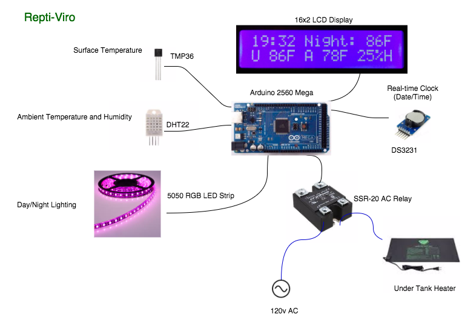

## ReptiViro

An Arduino based Reptile Environment controller. Seperate day and night control of temperature using a Solid State Realy to control an Under Tank Heater (UTH). Day (Yellow Glow) & Night (Purple) lighting using a 5050 RGB LED strip. LCD display of (A)mbient temperature relative (H)umidity, target surface temperature and actual (U) surface temp.   

## Motivation

I was looking for a better way to maintain the environment for my Leopard Gecko. Reptiles need specific surface temperatures, humidity and light, which differs during day and night.  

## Installation

You will need to install the libraries included in this "Libraries" folder. This is easily done by copying them under the Libraries folder in your Arduino IDE path.   

## Hardware

Arduino Mega 2560 (There isn't any reason you can't get this to run on something smaller like an UNO, it's just what I had)  
16x2 LCD Keypad for dispay ( I'm not currently using the keypad .. yet :)  
tmp36 taped down to the surface above my UTH to measure surface temps. I encased it in heatshrink and epoxy to keep out moisture.  
dht22 on the side of the tank near the top to measure ambient temp and relative humidity  
LED 5050 strip cut to 15 LED's to provide day and night light simulation  
SSR-20 relay with the AC side wired into a common extension cord. This way I can plug in my UTH's easily.  
ds3231 to keep accurate Date and Time for switching modes  

